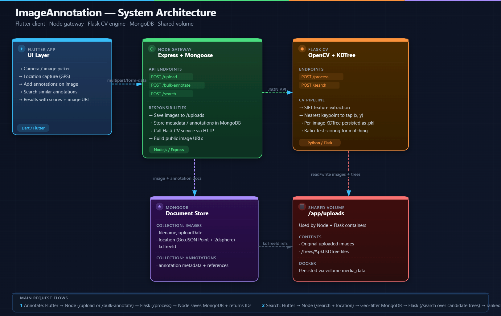

# Image Annotation & Retrieval System

[Live Website](https://image-annotation-portfolio.web.app/) · [Download APK (v1)](https://drive.google.com/file/d/14pNrvBevYYK2jyiZhaJK4M7xH4Fay8Jx/view?usp=drive_link)

## 1. Project Overview

**ImageAnnotation** is a multi-service platform for image annotation and visual search. It leverages a Flutter front-end, a Node.js API gateway, and a Flask/OpenCV computer-vision backend to deliver a seamless spatial mapping experience.

At a high level, the platform allows users to:

- **Capture or upload** an image.
- **Add multiple annotations** (tap points + text descriptions) to specific visual features.
- **Attach geolocation** automatically to each image.
- **Visual Search:** Submit a query image and location to retrieve ranked annotation matches from nearby images.

---

## 2. Architecture Summary

The system follows a 3-tier service architecture with storage split across MongoDB and a shared usage volume.

| Layer                 | Service                                | Tech Stack            | Responsibilities                                           |
| :-------------------- | :------------------------------------- | :-------------------- | :--------------------------------------------------------- |
| **Presentation**      | [FlutterApp](./FlutterApp/README.md)   | Flutter, Dart         | Camera integration, annotation UX, results rendering.      |
| **API Orchestration** | [NodeGateway](./NodeGateway/README.md) | Node.js, Express      | Upload handling, geospatial filtering, DB I/O, CV routing. |
| **CV Processing**     | [FlaskCV](./FlaskCV/README.md)         | Python, Flask, OpenCV | SIFT feature extraction, KDTree-based matching.            |
| **Data Layer**        | MongoDB & Docker                       | MongoDB, Shared Vol   | Image/annotation metadata, shared `media_data` volume.     |



---

## 3. Repository Structure

### Root

- `docker-compose.yml`: Orchestrates `node_gateway`, `flask_cv`, and `flutter_app` containers and defines the shared `media_data` volume.
- `README.md`: Project documentation.

### [NodeGateway](./NodeGateway/README.md)

- `server.js`: Main Express app, API routes (`/upload`, `/search`, `/bulk-annotate`), static image hosting, CORS.
- `database.js`: MongoDB connection helper.
- `models/`: Mongoose schemas for `Image` (geospatial index, `kdTreeId`) and `Annotation`.

### [FlaskCV](./FlaskCV/README.md)

- `app.py`: Flask API exposing `/process` and `/search`.
- `cv_engine.py`: Core CV primitives (SIFT extraction, KDTree persistence, nearest keypoint matching).

### [FlutterApp](./FlutterApp/README.md)

- `lib/main.dart`: App entry point, location gating.
- `lib/screens/`: UI for annotation flows, camera fallback, and ranked results.
- `lib/services/api_service.dart`: HTTP multipart API client.

---

## 4. Service-by-Service Deep Dive

### 4.1 Flutter Front-End

**Core Responsibilities:**

- Capture/pick images using `camera` and `image_picker`, while collecting precise location via `geolocator`.
- **Annotation Mode:** Users mark points and add descriptions.
- **Search Mode:** Users submit a query image + location for match retrieval.
- Send multipart requests to the Node gateway (`/bulk-annotate`, `/upload`, `/search`).

### 4.2 Node Gateway

**Core Responsibilities:**

- Handle image uploads via `multer` and serve them statically through `/uploads`.
- Persist metadata in MongoDB, including GeoJSON points (`[lon, lat]`).
- Delegate feature extraction and matching to the Flask CV service.
- Aggregate ranked matches with annotation text and image URLs for the frontend.

### 4.3 Flask CV Service

**Core Responsibilities:**

- Extract visual SIFT descriptors from images (`opencv-python-headless`).
- Map user taps to the nearest keypoint descriptor.
- Persist/load per-image KDTree artifacts using `joblib` and `sklearn.neighbors.KDTree`.
- Search query descriptors against candidate trees using KDTree NN matching and ratio testing.

---

## 5. Data and Storage Architecture

- **MongoDB Metadata:** Stores lightweight metadata and relational links (geospatial coordinates, tree IDs, semantic text, keypoint links).
- **Shared Volume (`media_data`):** Mounted at `/app/uploads` in both Node and Flask. Stores uploaded source images and `trees/*.pkl` KDTree artifacts. _This avoids redundant blob storage duplication and allows both services to read the same files directly._

---

## 6. End-to-End Request Flows

### 6.1 Annotate (Single / Bulk)

1.  **Flutter** sends multipart image + location + annotation points.
2.  **Node** persists image and metadata, then calls **Flask** for processing.
3.  **Flask** extracts SIFT features, updates the KDTree, and returns the keypoint identity.
4.  **Node** persists the annotations to MongoDB and returns a success response.

### 6.2 Search

1.  **Flutter** sends a query image + current location.
2.  **Node** geo-filters candidate images in MongoDB using `$near`.
3.  **Node** passes the candidate tree IDs to **Flask**.
4.  **Flask** computes ranked descriptor matches and returns them.
5.  **Node** maps keypoint IDs back to human-readable annotations and enriches them with image URLs.
6.  **Flutter** renders the ranked descriptions and images for the user.

---

## 7. Local Development & Getting Started

Follow these detailed steps to run the entire microservice architecture locally on your machine.

### Prerequisites

Before you begin, ensure you have the following installed:

- [Docker](https://docs.docker.com/get-docker/) & Docker Compose
- [Git](https://git-scm.com/)

### Step 1: Clone the Repository

```bash
git clone https://github.com/shishpal0666/ImageAnnotation.git
cd ImageAnnotation
```

### Step 2: Configure Environment Variables

Create a `.env` file in the root directory to configure your local variables.

Example `.env` configuration:

```env
# NodeGateway Config
MONGO_URI=mongodb://mongo:27017/image_annotation
FLASK_API_URL=http://flask_cv:5000
FRONTEND_URL=http://localhost:8080
BACKEND_PUBLIC_URL=http://localhost:3000

# Flutter Config (if passing via build args)
API_BASE_URL=http://localhost:3000
```

### Step 3: Build and Run with Docker Compose

Start the entire stack. Docker will pull the necessary base images, install dependencies for all three layers, and link the networking and volumes.

```bash
# Build the images and start the containers in detached mode
docker-compose up --build -d
```

### Step 4: Access the Application

Once the containers are running, the services will be exposed on the following ports:

- **Flutter Frontend:** `http://localhost:8080`
- **Node.js API Gateway:** `http://localhost:3000`
- **Flask CV Service:** Internal to Docker (Port 5000)
- **MongoDB:** Internal to Docker (Port 27017)

### Step 5: Viewing Logs and Stopping

To view the live logs of your services (useful for debugging CV processing or API routes):

```bash
docker-compose logs -f
```

To stop the system and spin down the containers:

```bash
docker-compose down
```

> **Note:** Adding the `-v` flag will also wipe the shared `media_data` volume and your MongoDB data.
